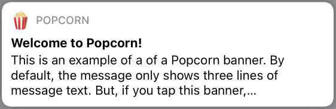

[](https://developer.apple.com/ios) 
[](https://swift.org) 
[](https://github.com/downtownjakebrown/Popcorn/stargazers)
[](https://github.com/downtownjakebrown/Popcorn/issues)
[](https://github.com/downtownjakebrown/Popcorn)
[](http://mit-license.org) 


## Overview

A framework for easily adding custom popups to your SwiftUI app. 


## Table of Contents:

- [Features](#features)
- [Installation](#installation)
- [Implementation](#implementation)
- [Example App](#example-app)
- [Popup Templates](#example-app)
- [Future Work](#future-work)
- [Contributing](#contributing)
- [License](#license)


## Features

... 

Explain more about the popups, how you can stylize them. How you can present them using the environemtn. How customizing the popups feels familiar because they are just views. How the popups have collision preventance because only one can be shown at a time. 


## Installation

`Popcorn` is available as a **Swift Package**. To integrate `Popcorn` into your Xcode project, specify this package's repository URL at `File -> Swift Packages -> Add Package Dependency...`

#### Repository URL:
```
https://github.com/downtownjakebrown/Popcorn.git
```

#### More on Swift Packages:
The [Swift Package Manager](https://swift.org/package-manager/) is a tool for managing the distribution of Swift code. It’s integrated with the Swift build system to automate the process of downloading, compiling, and linking dependencies.


## Implementation

#### Setup:

As described above, Popcorn is a system for creating, storing, and presenting popups in your SwiftUI app. At a high level, the system includes:
1. A (growing) number of customizable popup view templates;
2. A environmental view model for storing and coordinating presentation of the popup views; and
3. A view modifier for injecting the popup views and the environmental view model into your app's view hierarchy.

More on app setup...

#### Usage:

Once Popcorn has been setup in your app, its usage is straightforward. To show a popup simply set currentPopup equal to the reference name of the popup you want to show.

```Swift
let var = 0
```


## Example App

An example iOS app showing Popcorn in action can be found in this [GitHub repo](https://github.com/downtownjakebrown/PopcornExampleApp).

#### Example Project Installation

This is a description. The description goes here and describes things because it is a description. The description goes here and describes things because it is a description.


## Popup Templates

A short description of the templates. Prompts require user action to proceed. Banners notify users of something.

|  Name | Description | Example |       
| :---- | :---------- | :------ |
| `PopcornButtonsPrompt` | A popup prompt with two buttons. |  |
| `PopcornGetTextPrompt` | A popup prompt for getting user-input text. |  |
| `PopcornMessagePrompt` | A popup prompt for displaying a short message. |  |
| `PopcornBannerToast`     | An expandable banner for displaying a short message. |  |

## Future Work

Looking ahead, some additions may include:
* Writing tests
* More popup templates
* Queuing of banner popups 


## Contributing

Pull requests are welcome. For major changes, please open an issue first to discuss what you would like to change.


## License

Popcorn is available under the MIT license. See the [LICENSE](./LICENSE) file for more info.

