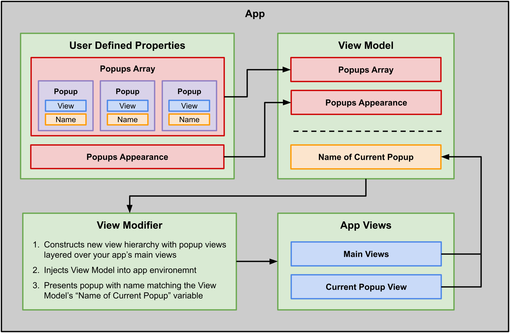

[](https://developer.apple.com/ios) 
[](https://swift.org) 
[](https://github.com/downtownjakebrown/Popcorn/stargazers)
[](https://github.com/downtownjakebrown/Popcorn/issues)
[](https://github.com/downtownjakebrown/Popcorn)
[](http://mit-license.org) 


## Overview

A framework for easily adding custom popups to your SwiftUI app. 


## Table of Contents:

- [Features](#features)
- [Installation](#installation)
- [Implementation](#implementation)
- [Example App](#example-app)
- [Popup Templates](#popup-templates)
- [Future Work](#future-work)
- [Contributing](#contributing)
- [License](#license)


## Features

... 

Explain more about the popups, how you can stylize them. How you can present them using the environment. How customizing the popups feels familiar because they are just views. How the popups have collision preventance because only one can be shown at a time. 

As described above, Popcorn is a system for creating, storing, and presenting popups in your SwiftUI app. At a high level, the system includes:
1. A (growing) number of customizable popup view templates;
2. A environmental view model for storing and coordinating presentation of the popup views; and
3. A view modifier for injecting the popup views and the environmental view model into your app's view hierarchy.

More on app setup...




## Installation

`Popcorn` is available as a **Swift Package**. To integrate `Popcorn` into your Xcode project, specify this package's repository URL at `File -> Swift Packages -> Add Package Dependency...`

#### Repository URL:
```
https://github.com/downtownjakebrown/Popcorn.git
```

#### More on Swift Packages:
The [Swift Package Manager](https://swift.org/package-manager/) is a tool for managing the distribution of Swift code. It’s integrated with the Swift build system to automate the process of downloading, compiling, and linking dependencies.


## Implementation


#### Example App:

An example iOS app showing Popcorn in action can be found in this [GitHub repo](https://github.com/downtownjakebrown/PopcornExampleApp). It may be helpful to download and explore the example app while learning how to implement Popcorn.


#### Setup:

**1. Create your popup views.**

You'll need to create a new view for each your custom popups. Below is an example of one custom popup view named `MessagePrompt`. Within the view's body, add one of the Popcorn popup template views. In this case, we're using Popcorn's `PopcornMessagePrompt` template view (see the [Popup Templates](#popup-templates) section for a list of other templates). You can customize your popup's appearance and behavior here via the template view.

```swift
/// A custom popup view
struct MessagePrompt: View {
    
    /// The popup view body
    var body: some View {
    
        /// A Popcorn Popup template view
        PopcornMessagePrompt(...)
        
    }
    
}
```

**2. Put your popup views in a `PopcornPacket`.**

Simply initialize your views within a `PopcornPacket`. `PopcornPacket` can currently hold up to 20 popup views.

```swift
let popcornPacket = PopcornPacket {
    MessagePrompt()
    ButtonsPrompt()
    GetTextPrompt()
    MessageBanner()
    // additional popups go here...
}
```

**3. Attach `.popcornMaker(...)` to your app's main view, and give it your `PopcornPacket`**

`popcornMaker(...)` is a view-modifying function that injects your custom popup views into your app's view hierarchy. It also creates an environmental view model named `Popcorn` and injects the view model into your app's view hierarchy. As described further below, the view model coordinates presentation of the custom popup views.

```swift
@main
struct PopcornExampleApp: App {
    
    /// A packet for holding your popups
    let popcornPacket = PopcornPacket {
        MessagePrompt()
        ButtonsPrompt()
        GetTextPrompt()
        MessageBanner()
        // additional popups go here...
       }
    
    // Setting the scene for our app, and injecting our popups
    // packet into the view heirarchy using the popcornMaker.
    var body: some Scene {
        WindowGroup {
            MainView().popcornMaker(popcornPacket)
        }
    }
    
}
```

#### Usage:

Once Popcorn has been set up in your app, its usage is straightforward. As mentioned above, `popcornMaker(...)` creates an environmental view model named `Popcorn` and injects the view model into your app's view hierarchy. To access the view model within a view, add popcorn as an `EnvironmentObject`.

```swift
@EnvironmentObject var popcorn: Popcorn
```

To show or hide a popup, you'll need to change the values of `popcorn.currentPrompt` or `popcorn.currentBanner`. `Popcorn` uses the type of the custom popups as reference to the custom popup views. To show `MessagePrompt`, for example, you'll set popcorn.currentPrompt equal to MessagePrompt.self. To hide `MessagePrompt`, for example, you can call `popcorn.dismissCurrentPrompt()`.

```swift
// Shows the MessagePrompt view
popcorn.currentPrompt = MessagePrompt.self

// Hides the MessagePrompt view
popcorn.dismissCurrentPrompt()
```


## Popup Templates

A short description of the templates. Prompts require user action to proceed. Banners notify users of something.

|  Name | Description | Example |       
| :---- | :---------- | :------ |
| `PopcornButtonsPrompt` | A popup prompt with two buttons. |  |
| `PopcornGetTextPrompt` | A popup prompt for getting user-input text. |  |
| `PopcornMessagePrompt` | A popup prompt for displaying a short message. |  |
| `PopcornBannerToast`     | An expandable banner for displaying a short message. |  |

## Future Work

Looking ahead, some additions may include:
* Writing tests
* More popup templates
* Queuing of banner popups 
* Support for custom fonts


## Contributing

Pull requests are welcome. For major changes, please open an issue first to discuss what you would like to change.


## License

Popcorn is available under the MIT license. See the [LICENSE](./LICENSE) file for more info.
