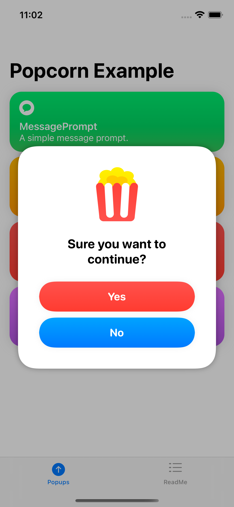

# Popcorn

[](https://developer.apple.com/ios) 
[](https://swift.org) 
[](http://mit-license.org) 

## Overview

A framework for easily adding custom popups to your SwiftUI app. 

## Table of Contents:

- [Features](#features)
- [Installation](#installation)
- [Example App](#example-app)
- [Implementation](#implementation)
- [Popup Templates](#popup-templates)
- [Future Work](#future-work)
- [Contributing](#contributing)
- [License](#license)

## Features

Popcorn is a system for creating, managing, and presenting popups in your SwiftUI app. At a high level, Popcorn includes:

1. A number of popup templates views with customizable appearance and behavior; 
2. A view modifier for injecting the popup views into your app's view hierarchy; and
3. A view model for coordinating presentation of the popup views.

## Installation

`Popcorn` is available as a **Swift Package**. To integrate `Popcorn` into your Xcode project, specify this package's repository URL at `File -> Swift Packages -> Add Package Dependency...`

#### Repository URL:
```
https://github.com/downtownjakebrown/Popcorn.git
```

#### More on Swift Packages:
The [Swift Package Manager](https://swift.org/package-manager/) is a tool for managing the distribution of Swift code. It’s integrated with the Swift build system to automate the process of downloading, compiling, and linking dependencies.


## Example App:

An example iOS app showing Popcorn in action can be found in this [GitHub repo](https://github.com/downtownjakebrown/PopcornExampleApp). It may be helpful to download and explore the example app while learning how to implement Popcorn.


## Implementation

### Setup

Setting up popcorn is simple. Create your custom popups, wrap them in a `PopcornPacket`, and put the `PopcornPacket` in the `.popcornMaker(...)`.

#### Create your popup views

You'll need to create a new view for each of your custom popups. Below is an example of one custom popup named `MessagePrompt`. Within the view's body, add one of the Popcorn popup template views. In this case, we're using Popcorn's `PopcornMessagePrompt` template view (see the [Popup Templates](#popup-templates) section for a list of other templates). You can customize your popup's appearance and behavior here via the template view.

```swift
/// A custom popup view
struct MessagePrompt: View {
    
    /// The popup view body
    var body: some View {
    
        /// A Popcorn Popup template view
        PopcornMessagePrompt(...)
        
    }
    
}
```

#### Put your popup views in a `PopcornPacket`

Simply initialize your views within `PopcornPacket`. `PopcornPacket` can currently hold up to 20 popup views.

```swift
let popcornPacket = PopcornPacket {
    MessagePrompt()
    ButtonsPrompt()
    GetTextPrompt()
    MessageBanner()
    // additional popups go here...
}
```

#### Attach `.popcornMaker(...)` to your app's main view, and give it your `PopcornPacket`

`popcornMaker(...)` is a view-modifying function that injects your custom popup views into your app's view hierarchy. It also creates an environmental view model named `Popcorn` and injects the view model into your app's view hierarchy. As described further below, the view model coordinates presentation of the custom popup views.

```swift
@main
struct PopcornExampleApp: App {
    
    /// A packet for holding your popups
    let popcornPacket = PopcornPacket {
        MessagePrompt()
        ButtonsPrompt()
        GetTextPrompt()
        MessageBanner()
        // additional popups go here...
       }
    
    // Setting the scene for our app, and injecting our popups
    // packet into the view heirarchy using the popcornMaker.
    var body: some Scene {
        WindowGroup {
            MainView().popcornMaker(popcornPacket)
        }
    }
    
}
```

### Usage:

Once Popcorn has been set up in your app, its usage is straightforward. As mentioned above, `popcornMaker(...)` creates an environmental view model named `Popcorn` and injects the view model into your app's view hierarchy. To access the view model within a view, add popcorn as an `EnvironmentObject`.

```swift    
@EnvironmentObject var popcorn: Popcorn
```

#### Show a popup:

To show a popup, change the values of `popcorn.currentPrompt` (if showing a prompt popup) or `popcorn.currentBanner` (if showing a banner popup). `Popcorn` uses the type of the custom popups as reference to the custom popup views. Thus, to show `MessagePrompt`, for example, just set `popcorn.currentPrompt` equal to `MessagePrompt.self`. 

```swift
/// A button to show a popup
struct ShowPopupButton: View {
    
    /// The popcorn view model
    @EnvironmentObject var popcorn: Popcorn

    /// The view body
    var body: some View {
        Button(action: {
            popcorn.currentPrompt = MessagePrompt.self
        }, label: {
            Text("Show Popup")
        })
    }
    
}
```

#### Hide a popup:
To hide a popup, call `popcorn.dismissCurrentPrompt()` (to hide a prompt popup) or `popcorn.dismissCurrentBanner()` (to hide a banner popup).


## Popup Templates

Popcorn currently includes two types of popups: prompts and banners. Prompts cover the screen and require user action to proceed. Banners notify the user of something, but the main UI is still accessible. Below is a list of Popcorn's current popup templates.

| `PopcornButtonsPrompt` | `PopcornGetTextPrompt` | `PopcornMessagePrompt` | `PopcornMessageBanner` |     
| :--- | :--- | :--- | :--- |
|  |  |  |  |

## Future Work

Looking ahead, some additions may include:
* More popup templates
* Queuing of banner popups 
* Support for custom fonts


## Contributing

Pull requests are welcome. For major changes, please open an issue first to discuss what you would like to change.


## License

Popcorn is available under the MIT license. See the [LICENSE](./LICENSE) file for more info.
